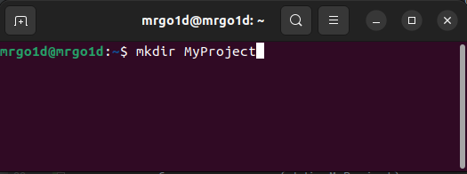
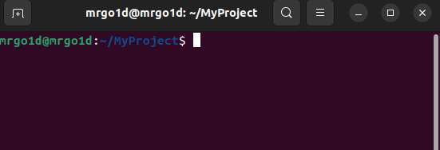
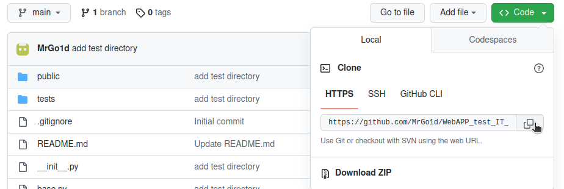
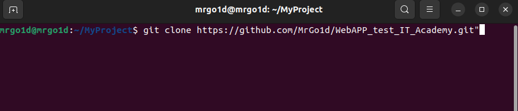
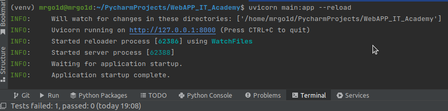
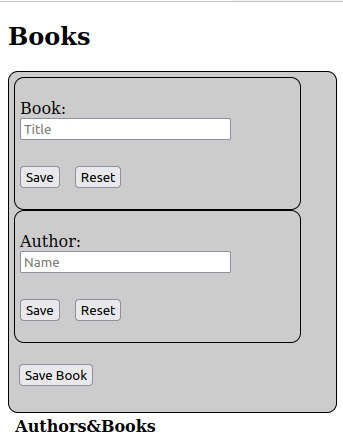

# WebAPP_test_IT_Academy
:man_student: Test task for the direction "Python development" (TEST)
https://docs.google.com/forms/d/e/1FAIpQLSdv_AzaXuggJZhlYKd2IOMBrYjc1P0o9f-iHGjIJ_Y5WhiVGg/viewform

Сервис реализован при помощи фреймворка fastapi.
Фрейморк отличается быстродействием, встроенной асинхронностью, валидацией, сериализацией.
Для работы fastapi необходим ASGI-сервер, по дефолту - uvcorn.

В проекте я использовал базу данных - SQLite. 
Она является  быстрой, поддерживает все основные SQL запросы, доступна "из коробки".
В качестве orm использовал sqlalchemy. Это универсальный инструмент, который позволяет работать с разными БД.

Сервис представляет собой интерфейс для работы с такими сущностями, как “КНИГА”(Book) и "АВТОР"(Author).
Для реализации отношений "многие-ко-многим" используется вспомогательная сущность BookAuthor (таблица book_authors).
Сущность "КНИГА" имеет строковое поле "title" (Название) и id, которое является ключом.  
Сущность "АВТОР" имеет строковое поле "name" (Имя) и id, которое является ключом.  
Сущность BookAuthor является вспомогательной и используется для связи сущностей "КНИГА" и "АВТОР" по id book_id и author_id соответственно.

Для запуска проекта необходимо установить python, желательно версию 3.11 или выше (https://www.python.org/).
Создать рабочую директорию (здесь и далее буду описывать шаги для ОС Ubuntu):
 - открыть терминал (ctrl + alt + T);
 - создать рабочую директорию (mkdir MyProject);

 - перейти в директорию (cd MyProject)

 - для изоляции окружения создадим виртуальную среду и активируем ее:
    python3 -m venv env
    source env/bin/activate
 - переходим по ссылке: https://github.com/MrGo1d/WebAPP_test_IT_Academy и копируем link проекта 

 - далее при помощи команды "git clone https://github.com/MrGo1d/WebAPP_test_IT_Academy.git"

копируем проект в локальную директорию и переходим в нее (cd WebAPP_test_IT_Academy)
 - для удобства развертывания желательно использовать программы для контейнеризации (например, Docker), 
однако времени не реализацию не хватило. Предусмотрен файл setup.py:
в консоли введите команду (pip install -e .), должна начаться автоматическая установка пакетов.
Если по какой-то причине этого не произошло - в проекте есть файл requirements.txt в котором сохранен список всех необходимых пакетов, 
которые можно установить при помощи команды (pip install package-name, for example pip install fastapi==0.95.0).
 - для запуска приложения необходимо ввести команду (uvicorn main:app --reload), на экране должны появиться сообщения:

- приложение запущено, для работы необходимо открыть в браузере http://127.0.0.1:8000/

Реализован минималистичный UI, который имеет два поля: Book и Athor.
Для того, что бы создать автора необходимо ввести его имя в поле и нажать кнопку "Save". Аналогичная работа с полем Book.
Так же при помощи UI можно изменять и удалять автора или книгу.
Для того что бы создать Автора и привязат к нему Книгу необходимо выбрать автора и книгу из списка, нажатием кнопки "Edit"
и нажать "Save Book". Отображение для этой сущности не настроено, так что в списке ничего не отобразится.
Так же при изменении и удалении рекомендую обновдять страницу, т.к. информация может отображаться некорректно.

Работа с https запросами.
В fastapi одним из главных достоинств является автоматическая документация (http://127.0.0.1:8000/docs) и 
все реализованные сервисы можно увидеть там.

http://127.0.0.1:8000/api/books
    GET: список книг;
http://127.0.0.1:8000/api/books/{id}
    GET: возвращает автора с переданным c id;
    POST: создаем новую книгу, в title передаем название;
    PUT: изменяем существующую книгу, передаем id книги и новый title;
    DELETE: удаляем книгу с переданным id;

Аналогичным образом работаю запросы и с сущностью "АВТОР":
http://127.0.0.1:8000/api/authors
    GET: список авторов;
http://127.0.0.1:8000/api/authors/{id}
    GET: возвращает автора с переданным c id;
    POST: создаем нового автора, в name передаем имя;
    PUT: изменяем имя существующего автора, передаем id и новое name;
    DELETE: удаляем автора с переданным id;

http://127.0.0.1:8000/api/author_books
    GET: получаем список зависимостей author_id, book_id
    POST: создаем зависимость 

Check-list:
    Код сервиса доступен для просмотра в каком-нибудь хранилище типа GitHub.

    + Код сервиса написан с использованием Python >= 3.9 (Python 3.11).
    - В проекте существует хотя бы один автоматический тест, подтверждающий работоспособность сервиса в части реализации.
    +- В проекте сконфигурирован минимально рабочий CI/CD пайплайн.
    + Сохранённая информация остаётся доступной после перезагрузки сервиса. (сервис реализован с использованием БД SQLite)
    + В проекте есть инструкция о том, как проект запускать. Взяв инструкцию, разработчик любого уровня может выполнить её буквально, не задавая вопросов, и в результате получит работающий сервис.
    + С работающим сервисом можно общаться с помощью HTTP запросов.
    + Сервис предоставляет интерфейс для работы с такой сущностью, как “КНИГА”.
    + Можно сохранить информацию о книге, отправляя HTTP запрос на сервис.
    + Можно получить информацию о сохранённых книгах, отправляя HTTP запрос на сервис.
    + Сервис предоставляет интерфейс для работы с такой сущностью, как “АВТОР”.
    + Можно сохранить информацию об авторе, отправляя HTTP запрос на сервис.
    + Можно получить информацию о сохранённых авторах, отправляя HTTP запрос на сервис.
    + Сущности “КНИГА” и “АВТОР” связаны отношениями: книга может быть написана несколькими (1 и более) авторами. Автор может написать 0 или много книг. (реализовано отношение многие-ко-многим)
    + Отношения сущностей “КНИГА” и “АВТОР” учтены при сохранении/чтении информации с сервиса. Сервис не допускает сохранения неподходящей информации. (предусмотрена проверка типа вводимых значений)